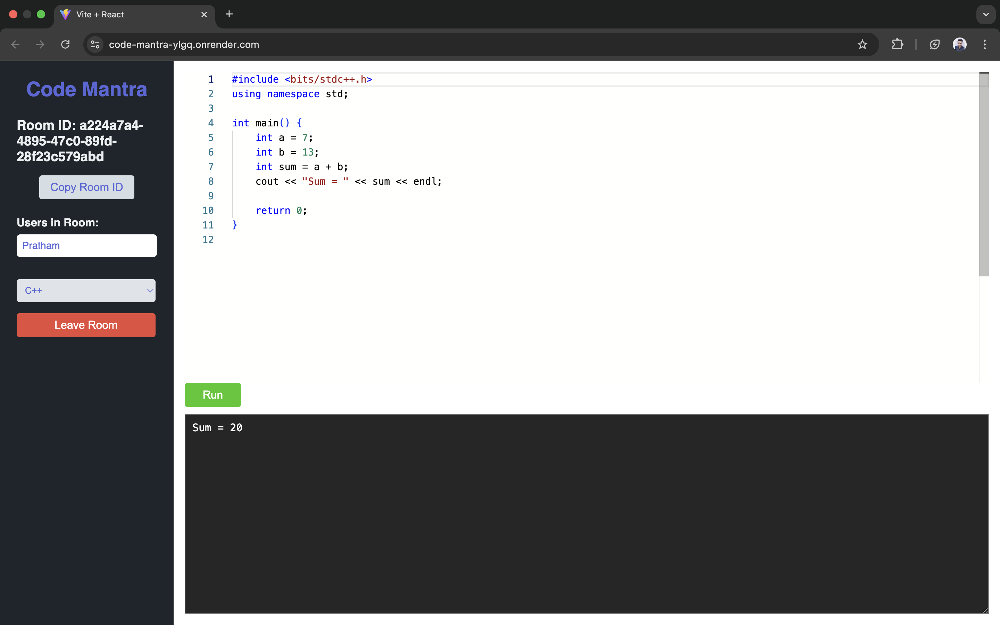

# Code Mantra  

**Code Mantra** is a real-time collaborative code editor that enables multiple users to work together on the same code, in the same editor, at the same time.  
It’s designed for **doubt resolution**, **pair programming**, **interview preparation**, and **team coding sessions**.  

---

## Features  

- **Real-time Code Synchronization** – Any code changes are instantly reflected for all users in the same room.
- **Compiler support** - Anyone inside the same room and compile the code.
- **Multiple Language Support** – Switch between JavaScript, Python, C++, and Java.
- **Room-based Collaboration** – Join or create a room using a unique Room ID.
- **User Presence Tracking** – See who is in the room in real time.
- **Typing Indicator** – Know when someone is typing.
- **Clipboard Copy** – Quickly copy the Room ID to share with others.
- **Leave Room Safely** – Automatically handle room exit and user updates.

---

## 🛠️ Tech Stack  

**Frontend:**  
- React.js  
- Monaco Editor (`@monaco-editor/react`)  
- Socket.IO Client  

**Backend:**  
- Node.js  
- Express.js  
- Socket.IO  

---
## By default:

- **Backend** runs on [http://localhost:3000](http://localhost:3000)  
- **Frontend** runs on [http://localhost:5173](http://localhost:5173) (Vite default)  

---
## 📸 Screenshot  

  

  

---

## How to Use

1. Open the app in your browser.  
2. Enter a **Room ID** and your **Name**, then click **Join Room**.  
3. Share the Room ID with your friends/teammates.  
4. Start coding together in real time!  

---

## Contributing

Contributions and suggestions are welcome!  
Please open an issue or submit a pull request.

---

## Author
**Pratham Dangaich**
 
**GitHub:** [prathamdangaich](https://github.com/prathamdangaich)

